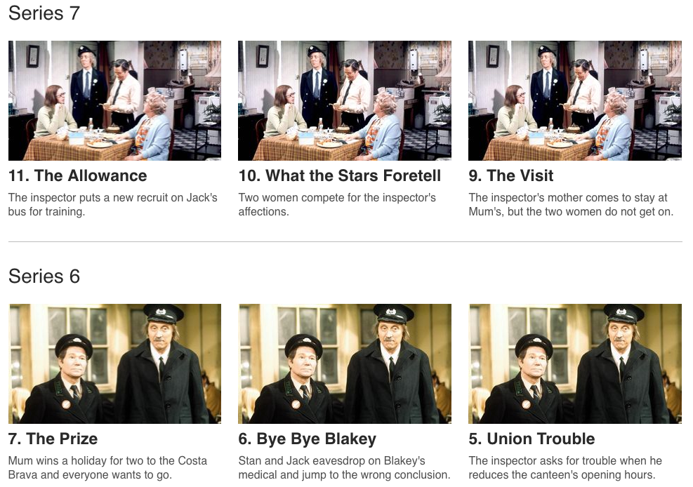

## Browser Test

### Information
This test is meant as a talking point during the interview process. Please be mindful of how long you spend on the test. We are not expecting you to spend more than a few hours on it.

Create a private fork of this repository to your own GitHub account. Work on your fork, please **do not submit a pull request**. When you are done email james.alexander@itv.com to say that your code is ready for review, and include your GitHub username.

### Setup

You will need Ruby installed for `grunt-contrib-sass` to work.
See [here](https://github.com/gruntjs/grunt-contrib-sass#sass-task) for instructions.

```
npm install
```

### Build
`grunt` for a one off run or
`grunt dev` for a watch task

### The Tasks
First off there is a bug that is stopping the page from rendering, please fix this and get the page loading correctly.

Next, the HTML has a severe case of DIVitis, please correctly semantically markup the page.

Now we would like you to pull in [this feed](http://discovery.hubsvc.itv.com/platform/itvonline/browser/programmes/L0768?broadcaster=itv) and add programme information into a section at the top of the page including; programme title, programme synopsis, episode count and channel. It should look something like this and be fully responsive:


### Pick at least two from the below:
#### Latest indicator
Add a lozenge to the most recent episode as pictured below:


#### Series breaks
Group each series together and put in a divider like below:



#### Synopsis on hover
Hide the synopsis for each episode and make it appear on hover, over the image with a semi-transparent light-grey background.

#### Unit test
Write units tests to cover your work.

#### Responsive images
Use a picture tag, and the variables in the image URL to set breakpoints appropriate for the existing breakpoints.

#### Dates
Display and format broadcast date and time
